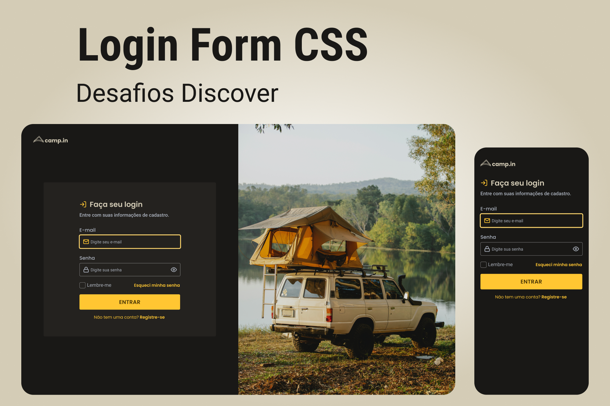

# Login-Page
<h3 align = "center">

</h3>

## Proposta do Desafio
Criar um formulário de Login.

## Linguagens Utilizadas 

<ul>
  <li>Html</li>
  <li>Css</li>
  <li>JavaScript</li>
 </ul>
 
## Fonte do Layout
 [Template LoginPage](https://www.figma.com/file/SX8XFyC5fAY09ai8Oykz0T/DD-%2F-Login-Form---CSS/duplicate)
